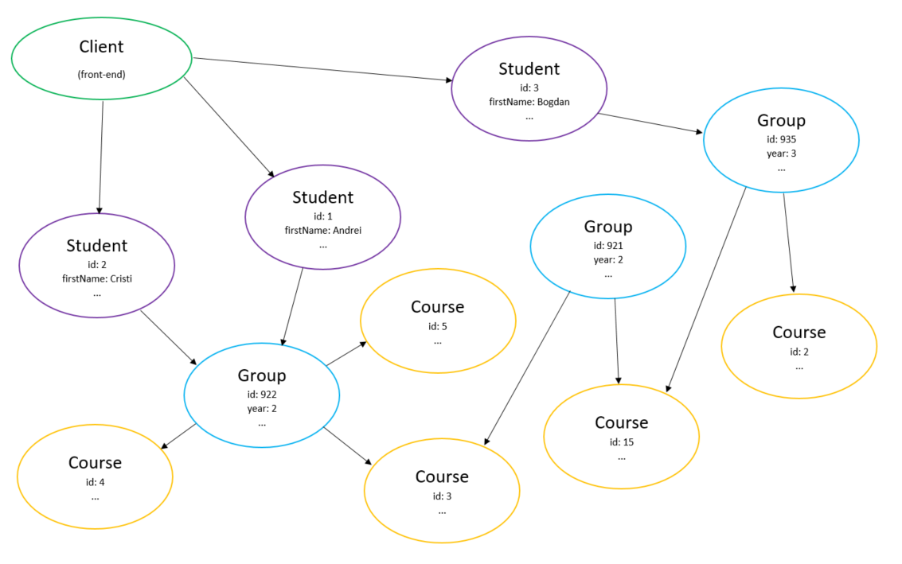
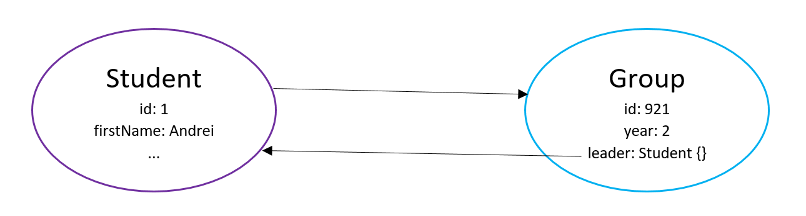

# GraphQL: A Brief Presentation

### by Alexandrescu Andrei-Robert (921)


## Table of Contents

1. [Description](#description)
2. [Motivation](#motivation)
3. [Prerequisites](#prerequisites)
4. [Dependencies](#dependencies)
5. [Setup](#setup)
6. [Database Structure](#databasestructure)
7. [Project Structure](#projectstructure)
8. [Example Queries](#examplequeries)
9. [Aliases](#aliases)
10. [Fragments](#fragments)
11. [Variables](#variables)
12. [Mutations](#mutations)
13. [Graph Structure](#graphstructure)
14. [Pagination](#pagination)
15. [Language Support](#languagesupport)
16. [Microservices](#microservices)
17. [References](#references)

## Description

GraphQL is a query language for APIs which provides an easy-to-understand description of the data in your API, giving clients the opportunity to ask exactly for what data they need and nothing more. In other words, instead of having an API with multiple end points, GraphQL allows you to query them all as if there was only one endpoint.

## Motivation

Before using GraphQL we must understand why should applications even bother to use this technology.

In a classic Client-Server application that follows the REST principles, the client application exchanges information with the server through multiple endpoints. For each endpoint, the type of request must be specified (get, post, delete, ...) in order to have a successful transaction.


This comes with a number of disadvantages for the client application such as:

- having to know about each api end point and the type of requests they allow
- fetching data can not be truncated before coming from the server unless special endpoints are designed for it (which destroys the REST principles)
- having to send multiple requests for complex queries, thus extending the loading time on the client application

GraphQL add a layer between the Client and the Server as such:

- the Client sends queries to the GraphQL layer
- the GraphQL takes the queries and resolves them by making API requests
- the requests' results are sent back to the Client application


This approach solves the issue mentioned before:

- the Client communicates only with the GraphQL server by means of queries without having to know about each endpoint that the back-end Server has to offer
- the Client can specify exactly the data needed without having to filter or truncate it upon arrival on the front-end
- a single request is sent from the Client, thus reducing the complexity of the work peformed on the front-end

## Prerequisites:

Make sure you have installed the following packages.

- [nodeJS](https://nodejs.org/en/download/)
- [yarn](https://classic.yarnpkg.com/en/docs/install)

## Dependencies:

These are be installed automatically once you follow the setup rules explained further.

- [typescript](https://yarnpkg.com/package/typescript)
- [ts-node-dev](https://yarnpkg.com/package/ts-node-dev)
- [express](https://yarnpkg.com/package/express) and [@types/express](https://yarnpkg.com/package/@types/express)
- [express-graphql](https://yarnpkg.com/package/express-graphql)
- [graphql](https://yarnpkg.com/package/graphql)
- [graphql-tools](https://yarnpkg.com/package/graphql-tools)
- [graphql-depth-limit](https://yarnpkg.com/package/graphql-depth-limit)
- [axios](https://yarnpkg.com/package/axios)
- [json-server](https://yarnpkg.com/package/json-server)

## Setup:

1. Make sure you have the Prerequisites installed on your machine
2. Open a CLI in the root directory of the project and run the following command: **yarn** (this installs all the dependencies needed to your local project)
3. Start the json-server by running **yarn json:server**
   (it should be running on localhost:4000)
4. Start the Express server by running **yarn dev:server** (it should be running on localhost:3001)
5. Navigate to http://localhost:4000/graphql to play around with the GraphiQL tool
6. Test that everything works properly by going to GraphiQL and pasting the following query on the left side:

```
{
  students {
    firstName
    lastName
    group{
      id
      year
      leader
    }
  }
}
```

Then click on the "Execute Query" button at the top (or hit ctrl+enter on your keyboard).

This query should fetch data about all the students and their corresponding groups.

## Database Structure<a id="databasestructure"></a>

The database contains three entities: Students, Groups and Courses. These entities are stored in a .json format database, allowing for ease-of-access together with json-server.
**Students** [<ins>id</ins>, firstName, lastName, email, groupId, phoneNumber]
**Groups** [<ins>id</ins>, year, leader, noStudents, courseIds]
**Courses** [<ins>id</ins>, name, lecturer, credits]

## Project Structure<a id="projectstructure"></a>

The project consists of three main areas:

- server.ts: This file contains the Express server. It also servers as the entry point of the GraphQL server-side application (also provides [schema stitching](https://www.graphql-tools.com/docs/schema-stitching/)).

- schemas: This is where the schemas used by GraphQL are declared. Each schema is composed of three parts:

  - the type declaration of the entity in that schema
  - the rootQuery which represents the entry point into the graph (since all these entities and their fields can be visialized as graphs)
  - the mutations which are used for changing the data (insert, update, delete)

- api: This is where all the api calls that are sent to the server to fetch/modify data are stored. ([axios](https://github.com/axios/axios) is used for taking care of the asynchronous behavior of these calls)

## Example Queries<a id="examplequeries"></a>

As you follow these exampes, you are more than encouraged to run them in your GraphiQL tool in order to see the live results and create your own queries. To do that, make sure you have read the [Setup](#setup) part of the documentation.

- fetch the students' id, firstName and groupId

```
{
    students {
        id
        firstName
        groupId
    }
}
```

This query will return all the students in the database, displaying their id, firstName and groupId. Notice here that the query asks for a specific set of attributes corresponding to the Student entity (id, firstName, groupId). This way we do not have to bring the whole student in our application and filter out the fields we are not interested it, but we may explicitly ask GraphQL for the fields we need and it will take care of the filtering in the background.

- fetch all the students together with their groups

```
{
    students {
        id
        firstName
        group{
            id
            year
        }
    }
}
```

We again ask for all the students, however now we also want information regarding the group each student is in. Thus, we may explicitly specify the fields we need for the group (id, year) without having to fetch both the students and groups and filter them in the application.

This is another feature that makes GraphQL stand out of the crowd: being able to make explicit api calls and receive exactly what was requested. As a consequence to this, applications using GraphQL are fast and stable since they control the data they got, not the server.

- fetch all the course names for all students

```
{
  students{
    id
    group{
      id
      courses{
        name
      }
    }
  }
}
```

This example showcases how deep the queries can go (and this is not the limit). The courses are assigned to groups, each student belonging to a group. Thus we need to pass through the groups to reach the courses for a given student.

- fetch a student's courses

If we wanted to find only the courses for a given student by its id we could do the following:

```
{
  student(id: 1){
    group{
      courses{
        name
        credits
      }
    }
  }
}
```

This query retrieves the student with id: 1, then finds its corresponding group and then the courses associated to that group, extracting only the name and numer of credits.

- fetch the leader for a given student

For the student with id: 4 we want to find the _firstName_ and _lastName_ of the group leader.

```
{
  student(id: 4) {
    group {
      leader {
        firstName
        lastName
      }
    }
  }
}
```

Without GraphQL, this query requires the Client application to send multiple requests to the Server application and filter them out on the client-side. Luckily, there is no need for that with the power of GraphQL on our side.

## Aliases

In case you want to run multiple queries at the same time and of the same type, GraphQL complains because of the duplicate types with differing arguments. Thus, the following code snippet is not a valid query.

```
{
  student(id: 1){
    firstName
    lastName
    groupId
  }
  student(id: 2){
    firstName
    lastName
    groupId
  }
}
```

In order to solve this issue, **Aliases** were introduced, giving each separate query a different identity. Notice how the names _studentId1_ and _studentId2_ were used for the two queries.

```
{
  studentId1: student(id: 1){
    firstName
    lastName
    groupId
  }

  studentId2: student(id: 2){
    firstName
    lastName
    groupId
  }
}
```

## Fragments

Suppose we may see two students side by side, along with their group's year. This situation implies repeating the same query, but passing in different arguments (i.e. the id of the student to be fetched).

This situation may be solved by using **Fragments** which are reusable units that let you construct sets of fields and then include them in the queries where you need them.

```
{
  leftStudent: student(id: 1) {
    ...studentFields
  }
  rightStudent: student(id: 2) {
    ...studentFields
  }
}

fragment studentFields on Student {
  firstName
  lastName
  group {
    year
  }
}
```

Observe how we are using two aliases, _leftStudent_ and _rightStudent_, in order to define the two student types. Then we use the spread operator in order to use all of the fields inside the fragment _studentFields_ which is defined below.

This example also showcases the **hoist**-like functionality of GraphQL queries (read more about it [here](https://developer.mozilla.org/en-US/docs/Glossary/Hoisting)).

## Variables

In most applications, the arguments of the queries will be dynamic, thus it is not desired to pass these arguments directly in the query string, because the Client will have to dynamically parse the query string and serialize it into a GraphQL-specific format.

Instead, GraphQL has integrated a way to do this by means of **variables**. These are defined using the dollar ($) character as such:

```
{ $variable: Value }
```

Let us see an example of this. We shall be fetching a student based on its id which will be passed from a variable. The query looks something like this:

```
query StudentByVariable($studentId: Int = 1) {
  student(id: $studentId){
    id
    firstName
    lastName
  }
}
```

Observe that we gave the parameter a default value of 1 in case none is passed. If this query is ran like this, the default value will be considered. In order to change it, an explicit variable declaration must be made.

```
{
  "studentId": 2
}
```

Note that the variables are defined in a special container at the bottom of the GraphiQL tool. This is a must because, as in most programming languages, the variables must be declared and initialized before being used.

## Mutations

In order to be a complete data platform, GraphQL introduced mutations. These are operations that allow the modification of the data. The project contains mutations for the Student and Course entities, allowing the basic CRUD operations, more specifically adding, deleting or updating.

Let us take a look at some examples:

- add a new Course

```
mutation {
  addCourse(name: "Machine Learning", lecturer: "Andrew NG", credits: 6){
    id
    lecturer
  }
}
```

Observe that the keyword **mutation** was used in order to let GraphQL know we want to modify the data in some way. The name of the mutation is **addCourse** which receives three parameters: name, lecturer and credits.
After the mutation is finished, the values for the id and lecturer will be returned. This is especially useful when the auto-generated data after the mutation (such as the id) is needed for further computations.

In order to make this mutation more abstract we may use a parametrized form.

```
mutation AddCourseMutation($name: String!, $lecturer: String!, $credits: Int!) {
  addCourse(name: $name, lecturer: $lecturer, credits: $credits) {
    id
    lecturer
  }
}
```

Notice how the types of the used fields end with an exclamation mark (**!**). This notation is used in order to apply a required constraint on those fields.

You might have observed that the query above does not work because the parameters have not been declared. To do that, add the following block of code to the _Query Variables_ window:

```
{
  "name": "test_name",
  "lecturer": "test_lecturer",
  "credits": 6
}
```

- delete a Student

```
mutation {
  deleteStudent(id: 5){
    id
    firstName
    lastName
  }
}
```

The returned id, firstName and lastName should be null values.

- update a Student

The fields to be modified may be explicitly specified in the arguments of the mutation. Only the id value is mandatory, the rest are optional.

```
mutation {
  updateStudent(id: 4, firstName: "Bogdan", lastName: "Manea"){
    id
    firstName
    lastName
  }
}
```

To check that the operation was successfully completed, the body of the mutation contains the id, firstName and lastName fields which should be populated with the new values.

## Graph Structure<a id="graphstructure"></a>

As the name suggests, GraphQL is a Query Language constructed on (oriented) Graphs in which the types represent the nodes of the graph and the relationships between types are the edges. For the sake of our discussion, consider the following query similar to the [examples](#examplequeries) above:

```
{
  students{
    id
    firstName
    group{
      id
      year
      courses{
        id
      }
    }
  }
}
```

A possible graph configuration that corresponds to this query is displayed below. The entry point is represented by the Client who sends the request (here we refer to the GraphQL Client). Then the Student nodes communicate with the Group nodes which in turn communicate with the Course nodes.



The creators of GraphQL based this whole technology's architecture on oriented graphs since they represent an efficient way of solving complex problems and querying may become an exhausting process.

This structural style does come with a huge disadvantage: traversing infinite cycles (circular dependencies). This issue can be caused by writing a query that calls itself as one may observe in the following picture:



Not taking care of such special cases allows for exploits such as the so-called **nested attacks** which look like this:

```
{
  students {
    firstName
    group {
      id
      leader {
        firstName
        group {
          id
          leader {
            firstName
            group {
              id
              [n leader]
                [n group]
            }
          }
        }
      }
    }
  }
}
```

Unfortunately, GraphQL does not provide a built-in solution for this issue yet, however there are a few way to avoid such situations:

- _Query Validation_ - explicitly look for such cases at the beginning
- _Query Timeout_ - abort queries that take too long
- _Query Whitelisting_ - compiling a list of queries that may be ran ahead of time (defeats the purpose of GraphQL)
- _Query Cost Limiting_ - abort queries that pass over a given cost threshold

Another solution to be considered here is represented by the use of Pagination which cuts the number of resources fetched at a time.

## Pagination

In order to avoid accessing all the data objects for a given entity type (imagine a database with millions of courses), the data must be paginated, that is limiting the depth of the traversal in the graph. This limitation can be specified using the keywords _first_, _offset_ and _after_.

- `students(first:2)` retrieves the first two students
- `students(first:2 offset:2)` retrieves the next first two students (so students with indexes 2 and 3, starting index is 0)
- `students(first:2 after:$studentId)` asks for the next two after the last student was fetched

The following example query asks for the first two courses for each group:

```
{
  groups {
    courses(first: 2) {
      name
    }
  }
}
```

There exists another type of pagination based on cursors which scales better than the one using offsets.

More on the limitations of GraphQL can be found [here](https://docs.github.com/en/graphql/overview/resource-limitations).

## Language Support<a id="languagesupport"></a>

Because GraphQL is a communication pattern, it offers many tools that can be used in a variety of languages. Find out more about the available languages [here](https://graphql.org/code/#language-support).

The current project uses [Typescript](https://www.typescriptlang.org) (superset of Javascript). On the Server Side there are multiple options that could be used in this case, such as [GraphQL.js](https://graphql.org/graphql-js/), [Apollo Server](https://www.apollographql.com/docs/apollo-server/), [Express GraphQL](https://graphql.org/graphql-js/running-an-express-graphql-server/) (the one used in the current project) and [GraphQL Yoga](https://github.com/prisma-labs/graphql-yoga) to name a few of the most popular choices among GraphQL lovers.

In order to integrate GraphQL with modern front-end technologies, a handful of options may be used, some of the most important ones being: [Apollo Client](https://www.apollographql.com/docs/react), [Relay](https://facebook.github.io/relay/), [AWS Amplify](https://docs.amplify.aws), [urql](https://formidable.com/open-source/urql/docs/) and [graphql-request](https://github.com/prisma-labs/graphql-request).

Besides the perks provided by GraphQL, Apollo Server and Client have their own state-management mechanisms following the [Redux](https://redux.js.org) principles.

## Microservices


One great benefit of using GraphQL as a separation layer between the clients and the server is that data can be routed more effectively than if each request had its own service.

More on this topic can be found [here](https://nordicapis.com/7-unique-benefits-of-using-graphql-in-microservices/).

## References

In the process of writing this document, multiple sources were considered. Most of the content comes from the official documentation which is fortunately well-written and in-depth enough to offer a consistent insight into GraphQL's chambers of secrets.

- [The official documentation](https://graphql.org/learn/)
- [Cheatsheet](https://devhints.io/graphql)
- [Recursive queries using fragments](https://hashinteractive.com/blog/graphql-recursive-query-with-fragments/)
- [Avoiding nested attacks](https://stackoverflow.com/questions/37337466/how-do-you-prevent-nested-attack-on-graphql-apollo-server)
- [GraphQL and Microservices](https://stackoverflow.com/questions/38071714/when-and-how-to-use-graphql-with-microservice-architecture)
- [GraphQL APIs: REST in Peace](https://www.youtube.com/watch?v=a52vko4BcNA)
- [Great introductory presentation on GraphQL](https://www.youtube.com/watch?v=bRnu7xvU1_Y)
